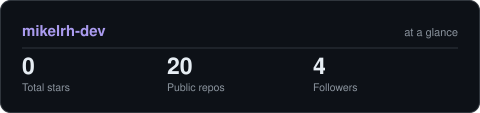

<!-- BANNER - terminal profile.sh --live (additive). Generated by scripts/banner/generate.py.
     ~0.7–0.8 MB each. Cache-bust with ?v=N after regenerating. -->
<picture>
  <source media="(prefers-color-scheme: dark)"  srcset="assets/banner-dark.v9.svg">
  <source media="(prefers-color-scheme: light)" srcset="assets/banner-light.v9.svg">
  
</picture>

 

<!-- NAME / TAGLINE - animated typing -->

 

<!-- SOCIALS — LinkedIn stays brand blue (glyph vanishes on custom fills). Others themed. -->

 

---

## This is me :)

**Mikel Romero Homobono** · Software Developer — AI/ML & Data Science · Barakaldo, Spain

> Technology is an endless rabbit hole: pull one thread and new branches appear — sooner or later they connect.

- 💼 **Software Developer at CEESA** (ex retail team lead — decisions & value under pressure): building real ERP with Velneo (Vespera Solutions) — real-time stock, tax and traceability, AI for inventory anomaly detection, order forecasting, KPI analysis, Telegram bot (real-time business alerts + RAG assistant over the ERP with Python + FAISS), agent-automated documentation.
- 🎓 **DAM graduate** (Tartanga, 2024–2026), specializing in AI & Big Data. Certified: Google x Kaggle 5-Day AI Agents intensive (prototype to production, multi-agent, ADK, evaluation, security) + Anthropic Claude API + Claude Code 101.
- 🤖 Obsessed with **AI, RAG systems, and local LLMs** — solid backend engineering meets production-ready intelligent systems.
- 🐍 **Python enthusiast**: FastAPI, scikit-learn, PyTorch, XGBoost — building ML pipelines and APIs that ship.
- 🌱 **My mission:** keep learning, keep building, keep shipping. Real projects, real impact.
- 💬 Talk to me about **AI/ML in production** and you'll have my full attention.
 

## my perfect stack

**Java · Python · Velneo · PHP** · PostgreSQL · MySQL · MongoDB · scikit-learn · pandas · NumPy · XGBoost · PyTorch · TensorFlow/Keras · OpenCV · RAG · local LLMs · MCP · Git · Docker · Linux

*Explores with AI/agents/data science, ships on engineering fundamentals.*

---

## featured projects

| | Project | What it does |
|---|---|---|
| 🎙️ | [liveInterviewRAG](https://github.com/mikelrh-dev/liveInterviewRAG) | AI voice interviewer — digital twin, STT→RAG→LLM→TTS, phrase-by-phrase SSE + reactive 3D avatar |
| 🔍 | [fraud-detector](https://github.com/mikelrh-dev/fraud-detector) | Hybrid 3-layer fraud detection — rules + XGBoost + context, SHAP explanations, local LLM draft reports |
| 📦 | [Proyecto-Velneo](https://github.com/mikelrh-dev/Reto_Practicas) | Full ERP — real-time stock/tax/traceability + AI at CEESA |

---

## signals

<table>
<tr>
<td width="50%" align="center" valign="middle">

<!-- Self-rated radar - edit assets/skills.json, the workflow redraws it -->
<picture>
  <source media="(prefers-color-scheme: dark)"  srcset="assets/radar-dark.svg">
  <source media="(prefers-color-scheme: light)" srcset="assets/radar-light.svg">
  
</picture>

</td>
<td width="50%" align="center" valign="middle">

<!-- Hand-authored contract & language stack radar - edit assets/langmix.json -->
<picture>
  <source media="(prefers-color-scheme: dark)"  srcset="assets/radar-langs-dark.svg">
  <source media="(prefers-color-scheme: light)" srcset="assets/radar-langs-light.svg">
  
</picture>

</td>
</tr>
</table>

---

## Numbers matter? ohhh yes. 

<!-- Generated by scripts/cards.py into this repo. Deliberately NOT
     github-readme-stats / streak-stats / github-profile-trophy: those are
     shared public instances that go down and take the whole section with them. -->
<picture>
  <source media="(prefers-color-scheme: dark)"  srcset="assets/card-stats-dark.svg">
  <source media="(prefers-color-scheme: light)" srcset="assets/card-stats-light.svg">
  
</picture>

 

---

## contact

📧 <a href="mailto:mikelromerohomobono@gmail.com">mikelromerohomobono@gmail.com</a> · 
<a href="https://github.com/mikelrh-dev">GitHub</a> · 
Barakaldo, Spain

Spanish native · English B2 · Euskera B1 · Available for hire

---

` Build with love · mikelrh-dev `

